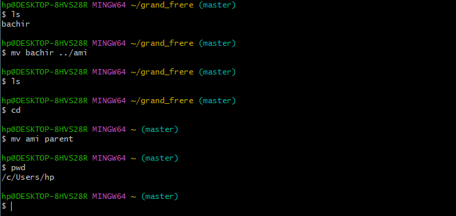

# Correction de l'exercice 1

## procedure suivie et commandes utilisées:

Voici dans l'ordre l'ensemble des commandes que j'ai eu a utilise et le role qu'elles ont eu:
* ```mkdir cli_tmp```:  pour creer le dossier cli_tmp.
* ```cd cli_tmp/```: afin d'acceder a cli_tmp.
* ```touch je_suis_dans_tmp.txt```: Pour creer le fichier vide je_suis_dans_tmp.txt.
* ```touch in_cli_tmp.txt```: Pour creer le fichier vide in_cli_tmp.txt.
* ```cd```: Pour revenir dans le repertoire personnel.
* ```rm -r cli_tmp/```: Pour supprimer le dossier cli_tmp ainsi que ce qu'il contient.
* ```mkdir grand_parent parent grand_frere grande_soeur ami connaissances```: Pour creer en une seule commande les dossiers grand_parent, parent, grand_frere, grande_soeur, ami, connaissances.
* ```cd grand_frere```: Pour acceder au fichier grand_frere.
* ```touch bachir```: Pour creer le fichier bachir.
* ```mv bachir ../ami```: Pour deplacer le fichier bachir dans le dossier ami se trouvant dans le repertoire personel (~).
* ```cd```: pour revenir dans le dossier personnel (~).
* ```mv ami parent```: Pour deplacer le dossier ami dans le dossier parent.
* ```pwd```: Pour afficher le chemin absolu de notre repertoire courant.

## Captures d'ecran des outputs:





## difficulte rencontre:

Lors de la realisation de cet exercice, j'ai eu a rencontre comme difficulte, dans un premier temps, j'avais eu du mal a saisir clairement les instructions, ce qu'il m'etait demande de faire. Savoir si avant de creer un fichier ou un sous dossier je dois d'abord me deplacer dans le dossier en question ou le faire depuis le dossier courant a travers les chemins relatifs.