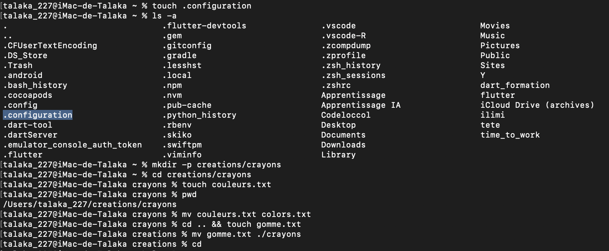

# Correction de l'exercice 4

## procedure suivie et commandes utilisées:
Voici dans l'ordre l'ensemble des commandes que j'ai eu a utilise et le role qu'elles ont eu:
* ```touch .configuration```: Pour créer le fichier *.configuration*
* ```ls -a```: pour afficher le contenu y compris ceux qui sont cachés.
* ```mkdir -p creations/crayons```: Pour créer en une seule commande l'arborescence *creations/crayons*.
* ```cd creations/crayons```: Pour acceder au dossier crayons.
* ```touch couleurs.txt```: Pour creer le fichier *couleurs.txt*
* ```mv couleurs.txt colors.txt```: Pour renommer *couleurs.txt* en *colors.txt*.
* ```cd .. && touch gomme.txt```: Pour retourner dans un premier temps dans le dossier creations, puis créer le fichier *gomme.txt*.
* ```mv gomme.txt •/crayons```: pour deplacer le fichier *gomme.txt* dans le dossier crayons.
* ```cd```: Pour revenir dans le repertoire personnel (~).

## Capture d'ecran de l'output:
