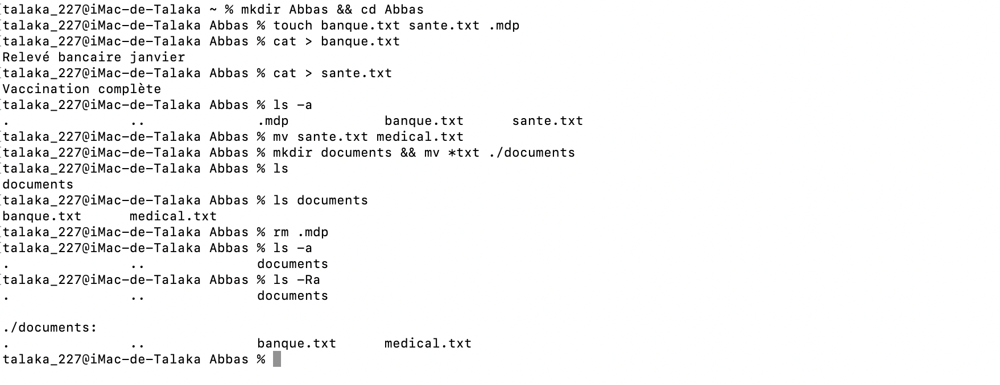

# Correction de l'exercice 6

## procedure suivie et commandes utilisées:
Voici dans l'ordre l'ensemble des commandes que j'ai eu a utilise et le role qu'elles ont eu:
* ```mkdir Abbas && cd Abbas```: Pour creer un repertoire portant mon nom et y acceder.
* ```touch banque.txt sante.txt .mdp```: Pour créer les fichiers banque.txt, sante.txt, et le fichier caché .mdp
* ```cat > banque.txt```: Pour écrire 'Relevé bancaire janvier' dans le fichier banque.txt.
* ```cat > sante.txt```: Pour écrire 'Vaccination complète' dans sante.txt 
* ```ls -a```: Pour afficher le dossier .mdp qui est caché.
* ```mv sante.txt medical.txt```: Pour renommer le fichier 'sante.txt' en 'medical.txt'.
* ```mkdir documents && mv *txt ./documents```: Pour créer un sous dossier 'documents', à l'intérieur duquel j'ai déplacé les fichiers banque.txt et medical.txt.

## Capture d'ecran de l'output:
