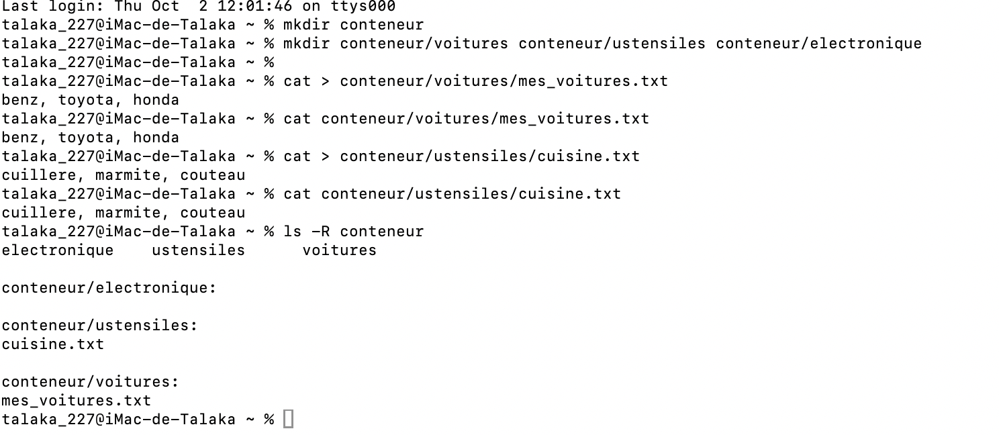

# Correction de l'exercice 2

## procedure suivie et commandes utilisées:

Voici dans l'ordre l'ensemble des commandes que j'ai eu a utilise et le role qu'elles ont eu:
* ```mdkir conteneur```: pour creer le dossier conteneur.
* ```mkdir conteneur/voitures conteneur/ustensiles conteneur/electronique```: Pour creer les dossiers voitures, ustensiles, electronique.
* ```cat > conteneur/voitures/mes_voitures.txt```: Avec cette commande, nous avons creer le fichier *mes_voitures.txt* se trouvant dans le dossier voiture et a l'interieur duquel nous avons mis benz, toyota, honda. Apres avoir taper au clavier les elements ajoutes, nous avons appuyer ^D ^D pour marquer la fin de l'inscription.
* ```cat > conteneur/ustensiles/cuisine.txt```: Avec cette commande, nous avons creer le fichier *cuisine.txt* se trouvant dans le dossier voiture et a l'interieur duquel nous avons mis cuillere, marmite, couteau. Apres avoir taper au clavier les elements ajoutes, nous avons appuyer ^D ^D pour marquer la fin de l'inscription.
* ```cat conteneur/ustensiles/cuisine.txt```: pour afficher le contenu de *cuisine.txt*.
* ```ls -R conteneur```: Pour lister le contenu du dossier conteneur.

## Capture d'ecran de l'output:
