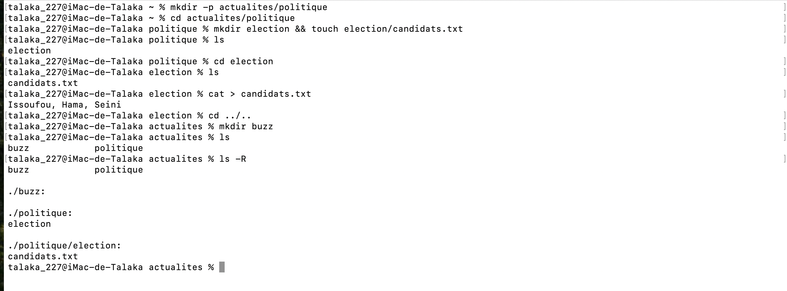

# Correction de l'exercice 3

## procedure suivie et commandes utilisées:
Voici dans l'ordre l'ensemble des commandes que j'ai eu a utilise et le role qu'elles ont eu:
* ```mkdir -p actualites/politique```: Pour créer l'arborescence actualites/politique.
* ```cd actualites/politique```: Pour entrer dans le dossier politique.
* ```mkdir election && touch election/candidats.txt```: Pour créer le dossier election ansi que le fichier candidats.txt à l'intérieur de election.
* ```cd election```: Pour accéder au dossier election.
* ```cat > candidats.txt```: Pour écrire Issoufou, Hama, Seini dans *candidats.txt*
* ```cd ../..```: Pour revenir de deux niveaux, c'est à dire, dans actualites.
* ```mkdir buzz```: Pour créer le dossier buzz dans actualites.

## Capture d'ecran de l'output:
