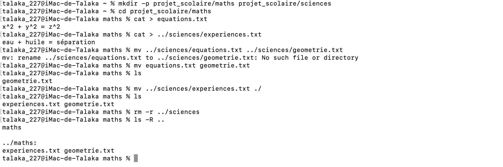

# Correction de l'exercice 5

## procedure suivie et commandes utilisées:
Voici dans l'ordre l'ensemble des commandes que j'ai eu a utilise et le role qu'elles ont eu:
* ```mkdir -p projet_scolaire/maths projet_scolaire/sciences```: Pour créer l’arborescence : projet_scolaire/maths projet_scolaire/sciences.
* ```cd projet_scolaire/maths```: Pour accéder à projet_scolaire/maths.
* ```cat > equations.txt```: Pour écrire l'équation x^2 +y^2 = z^2 à l'intérieur du fichier equations.txt.
* ```cat > ../sciences/experiences.txt```: Pour écrire eau + huile = séparation à l'intérieur de experiences.txt.
* ```mv ../sciences/experiences.txt ../sciences/geometrie.txt```: Pour renommer le fichier experiences.txt en geometrie.txt.
* ```mv ../sciences/geometrie.txt ./```: Pour déplacer le fichier geometrie.txt dans le dossier maths.
* ```rm -r ../sciences```: Pour supprimer le dossier sciences.

## Capture d'ecran de l'output:

